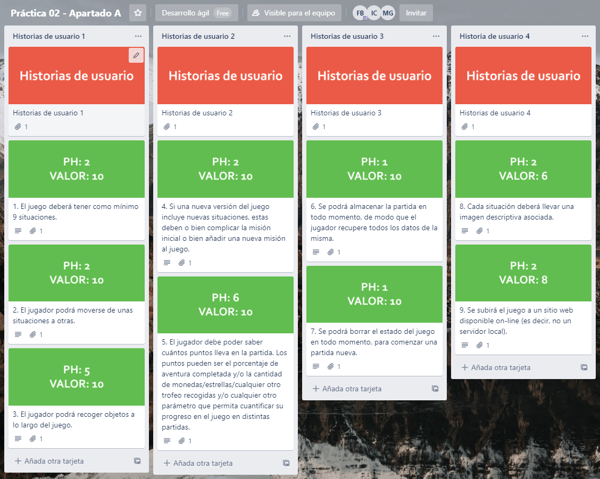

# Práctica 2
## Miembros del equipo de desarrollo
- Mario Díaz González: [mdg00013@red.ujaen.es](mailto:msg00013@red.ujaen.es)
- Ildefonso Serrano Civantos: [isc00024@red.ujaen.es](mailto:isc00024@red.ujaen.es)
- Francisco Javier Martínez Bueno: [fjmb0011@red.ujaen.es](mailto:fjmb0011@red.ujaen.es)
- Pablo Gimeno Yeste: [pgy00001@red.ujaen.es](mailto:pgy00001@red.ujaen.es)

##  Descripción de la trama del juego y el personaje
En este juego, eres un estudiante de ingeniería informática que se enfrenta a un rutinario día. Deberás elegir entre una serie de posibles acciones para conseguir tus objetivos: el primero es bajar a la universidad y el segundo es asistir a la clase correspondiente para aprobar la asignatura.

## Enlaces de interés
- **URL de proyecto en github:** click [aquí](https://github.com/desarrollo-agil-maj/practica02)
- **URL del tablero Trello:** click [aquí](https://trello.com/invite/b/QrlUc0qJ/697761a064e4ee6b5734bc0b47969e9c/pr%C3%A1ctica-02-apartado-a)

## Captura de pantalla del Product Backlog

