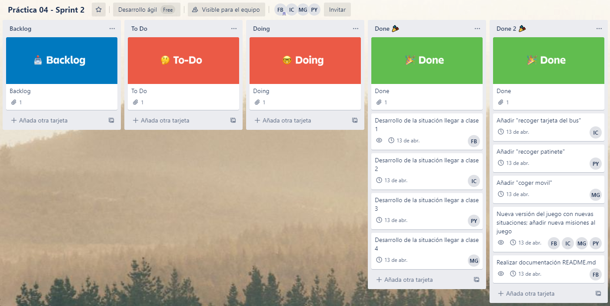

## Miembros del equipo de desarrollo
- Mario Díaz González: [mdg00013@red.ujaen.es](mailto:msg00013@red.ujaen.es)
- Ildefonso Serrano Civantos: [isc00024@red.ujaen.es](mailto:isc00024@red.ujaen.es)
- Francisco Javier Martínez Bueno: [fjmb0011@red.ujaen.es](mailto:fjmb0011@red.ujaen.es)
- Pablo Gimeno Yeste: [pgy00001@red.ujaen.es](mailto:pgy00001@red.ujaen.es)

##  Descripción de la trama del juego y el personaje
En este juego, eres un estudiante de ingeniería informática que se enfrenta a un rutinario día. Deberás elegir entre una serie de posibles acciones para conseguir tus objetivos: el primero es bajar a la universidad y el segundo es asistir a la clase correspondiente para aprobar la asignatura.

## Enlaces de interés
- **URL de proyecto en github:** click [aquí](https://github.com/desarrollo-agil-maj/practica02)
- **URL del tablero Trello:** click [aquí](https://trello.com/invite/b/QrlUc0qJ/697761a064e4ee6b5734bc0b47969e9c/pr%C3%A1ctica-02-apartado-a)

## Práctica 03 - Sprint 1

**Product Owner:** Francisco Javier Martínez Bueno. En nuestro caso, el Product Owner también programa.

### 1. Captura de pantalla de las historias de usuarios que habéis decidido que formen parte del Sprint Backlog y breve explicación de porqué se han elegido esas.

Hemos elegido las historias de usuario número 2, 6 y 7 porque aportan un gran valor a nuestro proyecto y los puntos de historia son muy bajos, por tanto, la implementación de dichas funcionalidades es fácil y asequible.

### 2. Captura de pantalla de dichas historias de usuario descompuestas en tareas al principio del Sprint.

### 3. Capturas de pantalla del Product Backlog y del Sprint Backlog tras las modificaciones realizadas en el Product Backlog Refinement.
Product backlog

Sprint backlog

### 4. Conclusiones obtenidas en la Sprint Review
- **Qué se ha “hecho” y qué no**
	- A pesar de no haber podido quedar físicamente, hemos hecho una reunión diaria telemáticamente para ir viendo qué tal íbamos cada uno de nosotros con nuestras tareas asignadas. 
	- Hemos realizado todas las tareas pertenecientes al sprint 1.
	- No nos ha quedado ninguna tarea pendiente por hacer en este sprint.
- **Qué ha ido bien, qué problemas y qué soluciones**
	- La organización ha ido genial, hemos podido vernos casi todos los días de la semana para hacer los Dailys Scrum.
	- No hemos podido vernos en persona por causas ajenas a nosotros pero hemos sido capaces de adaptarnos a la situación para desarrollar el proyecto de la mejor manera posible.
	- Cada integrante del equipo ha trabajo de forma coordinada y respetando todas las tareas asignadas previamente en el Sprint Planning.
- **¿Por dónde seguir? ¿Qué es lo siguiente que aporta más valor al producto?**
	- Realizaremos algunas de las historias de usuario que cuenten con un valor 10.
		- El juego deberá tener como mínimo 9 situaciones. **PH: 2 / VALOR: 10**
		- El jugador podrá recoger objetos a lo largo del juego. **PH: 5 / VALOR: 10**
		- Si una nueva versión del juego incluye nuevas situaciones, estas deben o bien complicar la misión inicial o bien añadir una nueva misión al juego. **PH: 2 / VALOR: 10**
- **Revisión de plazos y presupuesto**
	- Hemos sido capaces de entregar el primer Sprint a tiempo y con el presupuesto dado, por tanto, pensamos que entregaremos el producto en el plazo esperado.

### 5. Conclusiones obtenidas en la Sprint Retrospective
- **¿Qué ha ido bien?**
	- Hemos sabido organizarnos y desarrollar cada uno las tareas asignadas.
	- No hemos tenido ningún tipo de dificultad a la hora de realizar las tareas.
- **¿Cómo mejorar?**
	- Siempre se puede mejorar, por ejemplo, han habido varios días que no hemos podido hacer el Daily Scrum, esperamos poder reunirnos de forma diaria para el siguiente Sprint.

### 6. Captura de pantalla de las tareas del Sprint Planning al final del sprint (para ver cuántas se han acabado, cuántas se han quedado en fase de desarrollo o prueba, cuántas NO se han terminado, qué miembros se han asignado las tareas…)

### 7. Captura de pantalla de las historias de usuario del Sprint Backlog una vez acabado el sprint.

## Práctica 04 - Sprint 2

**Product Owner:** Ildefonso Serrano Civantos. En nuestro caso, el Product Owner también programa.

### 1. Captura de pantalla de las historias de usuarios que habéis decidido que formen parte del Sprint Backlog y breve explicación de porqué se han elegido esas.

Hemos elegido las historias de usuario número 1, 3 y 4 porque aportan un gran valor a nuestro proyecto y los puntos de historia son muy bajos, por tanto, la implementación de dichas funcionalidades es fácil y asequible.

- El juego ahora tendrá diez situaciones, por tanto, cumpliremos con creces la propuesta de implementar como mínimo nueve posibles escenarios. 
- El jugador podrá recoger diferentes objetos a lo largo del juego consiguiendo así una aventura gráfica amena y entretenida.
- En esta nueva versión del juego incluiremos nuevas situaciones, las cuales serán a su vez más complejas ya que añadiremos una nueva misión al mismo.

### 2. Captura de pantalla de dichas historias de usuario descompuestas en tareas al principio del Sprint.

- La historia de usuario *1.El juego deberá tener como mínimo 9 situaciones* se descompone en las siguientes tareas:
	- Desarrollo de la situación llegar a clase 1
	- Desarrollo de la situación llegar a clase 2
	- Desarrollo de la situación llegar a clase 3
	- Desarrollo de la situación llegar a clase 4

- La historia de usuario *3.El jugador podrá recoger objetos a lo largo del juego* se descompone en las siguientes tareas:
	- Añadir "recoger patinete"
	- Añadir "recoger llaves del coche"
	- Añadir "recoger tarjeta del bus"

- La historia de usuario *4. Si una nueva versión del juego incluye nuevas situaciones, estas deben o bien complicar la misión inicial o bien añadir una nueva misión al juego.* se descompone en las siguientes tareas:
	- Nueva versión del juego con nuevas situaciones; añadir nueva misiones al juego

Así mismo, hemos añadido otra nueva tarea *Realizar documentación README.md*

### 3. Capturas de pantalla del Product Backlog y del Sprint Backlog tras las modificaciones realizadas en el Product Backlog Refinement.
- Product Backlog

Tras exponer cada uno nuestro punto de vista acerca de los dos nuevos requisitos propuestos llegamos a la siguiente conclusión; los puntos de historia eran muy superiores al valor de la correspondiente historia de usuario, por tanto, no incluimos ningún nuevo requisito en el proceso de reorganización que debe hacerse en el Product Backlog Refinement.

- Sprint Backlog

### 4. Conclusiones obtenidas en la Sprint Review
- **¿Qué funcionalidades se han “implementado” y cuáles no?**
	- Se han implementado todas las funcionalidades pertenecientes al segundo sprint, teniendo en cuenta cada historia de usuario y las tareas en las que se ha descompuesto cada una de esas historias de usuario.
	- No nos ha quedado ninguna tarea pendiente por hacer en este sprint, hemos sido capaces de implementar todas y cada una de las tareas incluidas en esta iteración.
- **¿Se ha revisado product backlog y estimaciones de PH y valor?**
	- Sí, hemos revisado el product backlog, sin embargo, no hicimos ninguna modificación en el Product Backlog Refinement.
	- Todas las estimaciones de los puntos de historia y el valor de cada historia de usuario es el correcto.
- **Con respecto al Equipo de programación: ¿qué ha ido bien, qué problemas surgieron y qué soluciones dimos?**
	- La organización ha ido genial, hemos podido vernos más de la mitad de los días de la semana, por Google Meets, para hacer los Dailys Scrum.
	- No hemos podido vernos en persona por causas ajenas a nosotros pero hemos sido capaces de adaptarnos a la situación para desarrollar el proyecto de la mejor manera posible.
	- Cada integrante del equipo ha trabajo de forma coordinada y respetando todas las tareas asignadas previamente en el Sprint Planning.
- **¿Por dónde seguir? ¿Qué es lo siguiente que aporta más valor al producto?**
	- Realizaremos todas las historias de usuario que tenemos propuestas en nuestro Product Backlog.
		- El jugador debe poder saber cuántos puntos lleva en la partida. Los puntos pueden ser el porcentaje de aventura completada y/o la cantidad de monedas/estrellas cualquier otro trofeo recogidas y/o cualquier otro parámetro que permita cuantificar su progreso en el juego en distintas partidas. **PH: 6 / VALOR: 10**
		- Cada situación deberá llevar una imagen descriptiva asociada. **PH: 2 / VALOR: 6**
		- Se subirá el juego a un sitio web disponible on-line (es decir, no un servidor local). **PH: 2 / VALOR: 8**
		- Se deberá modificar el CSS del juego original, usando otras fuentes de letra, fondos de pantalla, etc. **PH: 3 / VALOR: 6**

### 5. Conclusiones obtenidas en la Sprint Retrospective
- **Inspección (personas, relaciones, procesos y herramientas)**
	- Todas las personas han trabajado de forma equitativa y cumpliendo la fecha de vencimiento asociada a cada tarea del Sprint.
	- Hemos intentado hacer los Dailys Scrum de forma diaria, sin embargo, ha sido dificil dada la situación en la que nos encontramos actualmente.
	- Las herramientas usadas para la realización de la práctica han sido Trello, GitHub y Visual Studio Code como editor de textos.
- **¿Qué ha ido bien?**
	- Hemos sabido organizarnos y desarrollar cada uno las tareas asignadas.
	- No hemos tenido ningún tipo de dificultad a la hora de realizar las tareas.
- **¿Cómo mejorar?**
	- Siempre se puede mejorar, han habido varios días que no hemos podido hacer el Daily Scrum dada la cantidad de entregas que tenemos que hacer estas semanas y la complejidad de las mismas, así mismo, no podemos reunirnos de forma física y por tanto la resolución de estas entregas es más compleja y tediosa.
- **Plan para implementar mejoras (adaptación)**
	- Hacer Daily Scrum de forma más periódica.

### 6. Captura de pantalla de las tareas del Sprint Planning al final del sprint (para ver cuántas se han acabado, cuántas se han quedado en fase de desarrollo o prueba, cuántas NO se han terminado, qué miembros se han asignado las tareas…)

Todas las tareas han sido realizadas y finalizadas a tiempo. Cada miembro del equipo se ha asignado dos tareas.

### 7. Captura de pantalla de las historias de usuario del Sprint Backlog una vez acabado el sprint.
